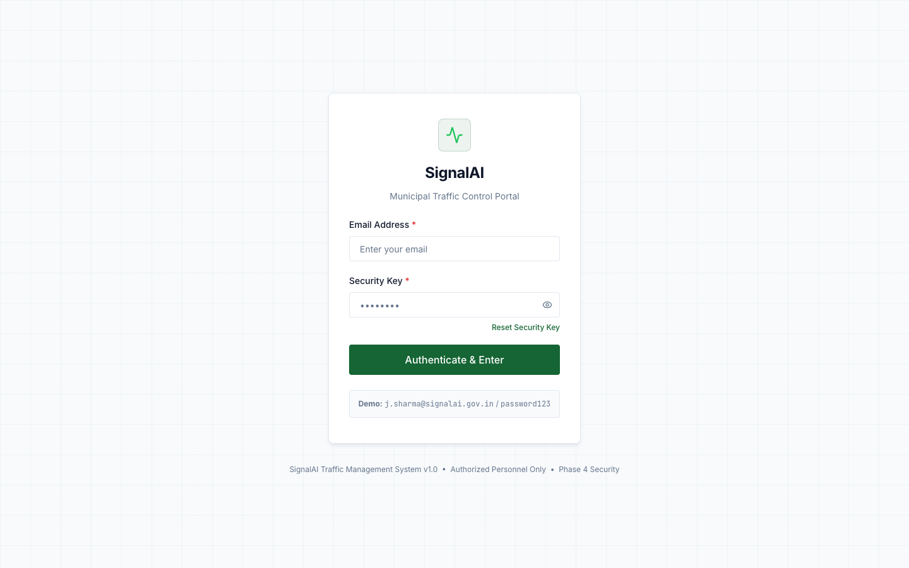
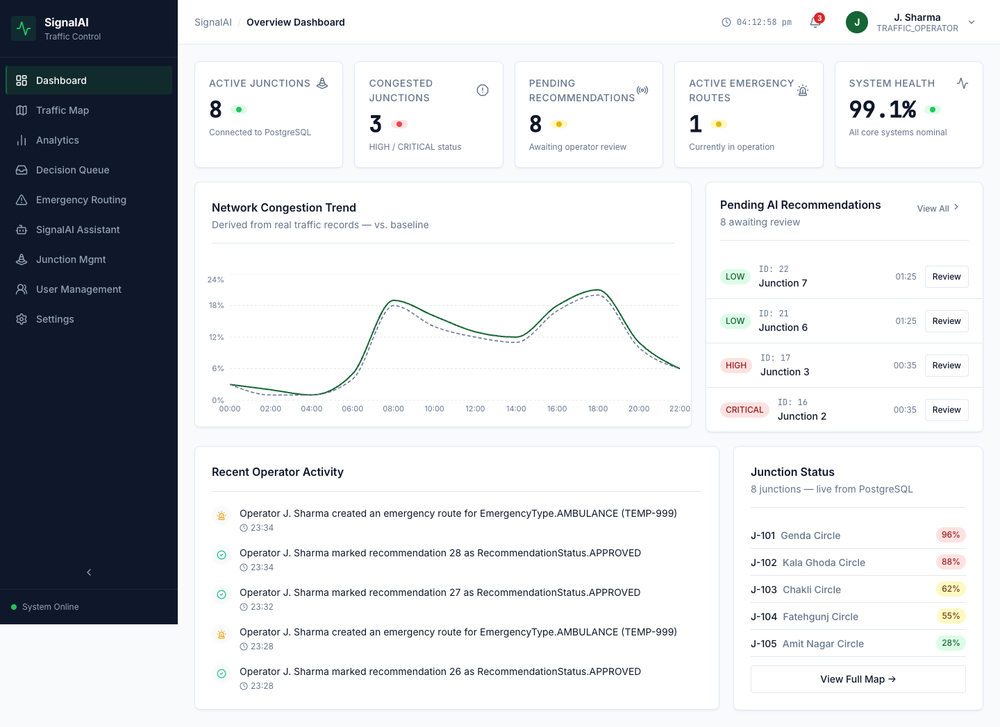
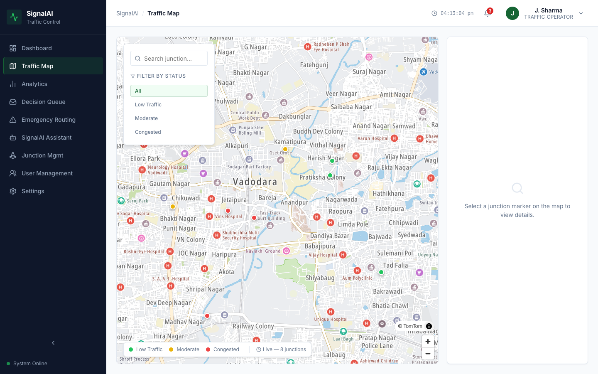
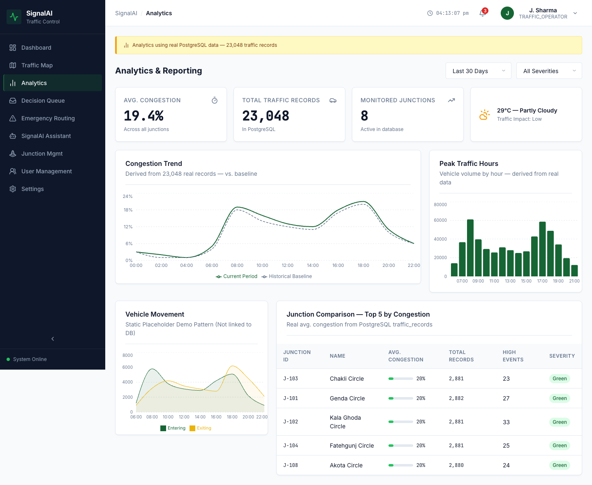
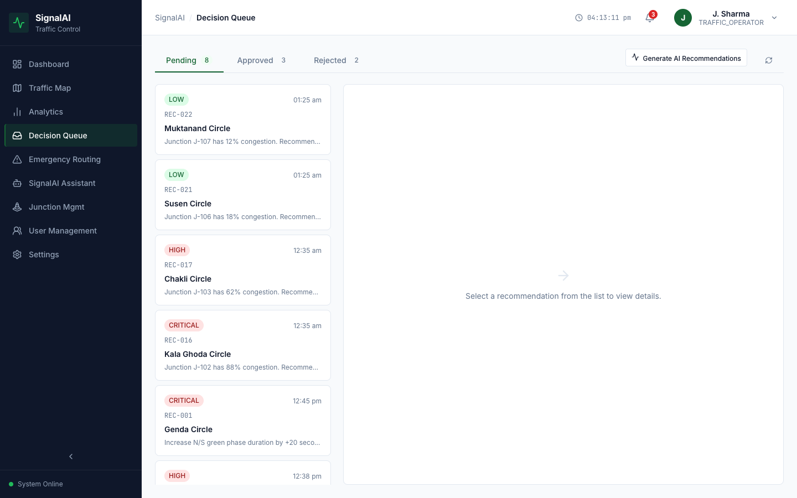
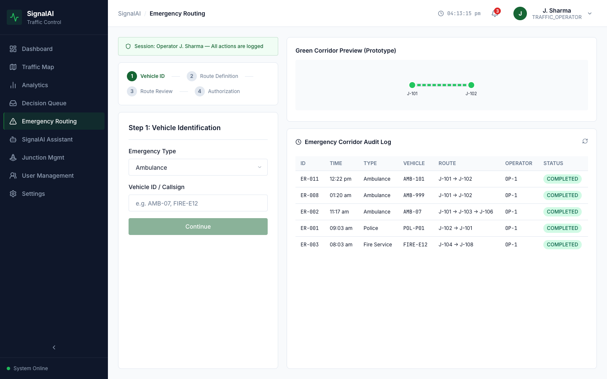
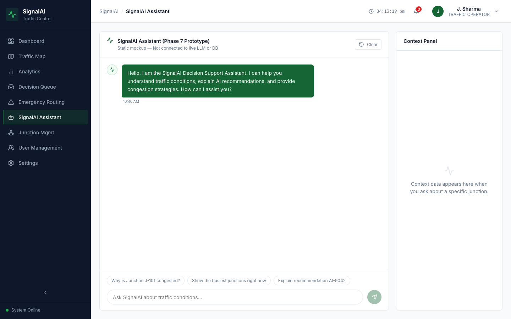
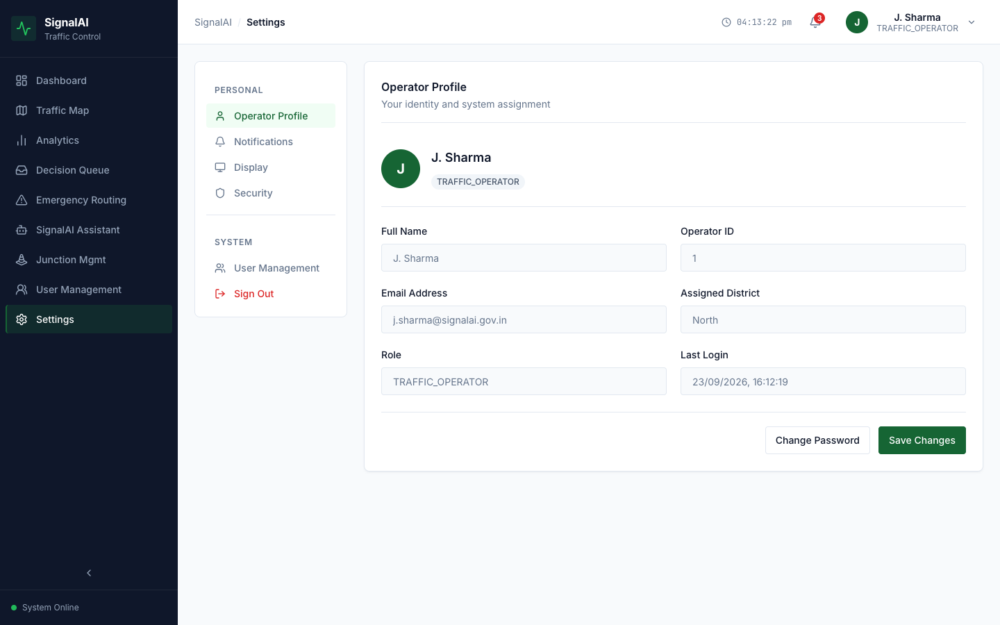
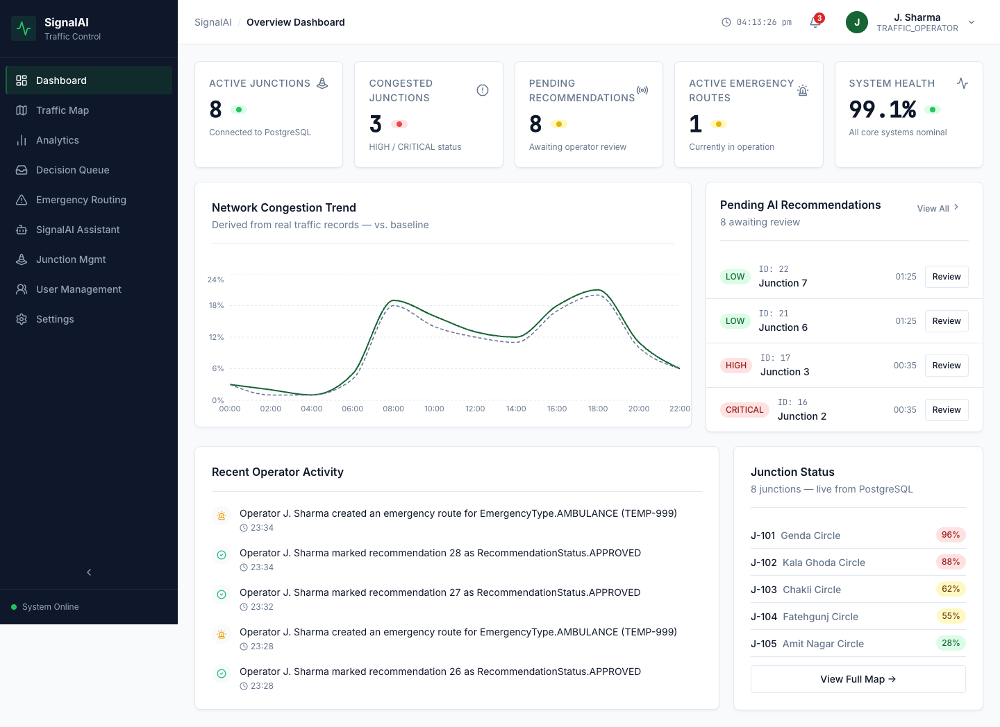

# 🚦 SignalAI — Municipal Traffic Control Portal

> **Phase 1 Prototype** — UI Layout & Form Design  
> An AI-driven smart traffic management system for urban intersections.

---

## 📋 Table of Contents

1. [Project Overview](#1-project-overview)
2. [📸 Screenshots](#-screenshots)
3. [Technology Stack](#2-technology-stack)
4. [Project Structure](#3-project-structure)
5. [Getting Started](#4-getting-started)
6. [🔐 Login Credentials (Demo)](#5--login-credentials-demo)
7. [User Roles & Accounts](#6-user-roles--accounts)
8. [Application Pages & Process Flow](#7-application-pages--process-flow)
9. [Mock Data Reference](#8-mock-data-reference)
10. [Navigation & Routing](#9-navigation--routing)
11. [Design System](#10-design-system)
12. [Development Phases](#11-development-phases)
13. [Scripts](#12-scripts)

---

## 1. Project Overview

**SignalAI** is an advanced, AI-driven traffic management system designed for municipal traffic control centers. It provides operators and administrators with a centralized, intuitive interface to:

- 📍 Monitor intersections in real time (mocked data in Phase 1)
- 📊 Analyze traffic flow with charts and analytics
- 🤖 Review and approve/reject AI-generated signal optimization recommendations
- 🚨 Activate emergency routing (Green Wave) for ambulances, fire trucks, and police
- 💬 Query the AI assistant for traffic insights
- 👥 Manage operator accounts and access levels (admin only)

> **Note:** All data in Phase 1 is **simulated/mocked**. No real backend, database, or AI is connected yet. This phase focuses entirely on the frontend layout, UI structure, and form design.

---

## 📸 Screenshots

> Real screenshots captured from the live application with PostgreSQL backend connected.

### 🔐 Login Page


---

### 📊 Dashboard — Overview & KPIs


---

### 🗺️ Traffic Map — Live Junction Monitor


---

### 📈 Analytics & Reporting


---

### 🤖 Decision Queue — AI Recommendations


---

### 🚨 Emergency Routing — Green Wave


---

### 💬 SignalAI Assistant


---

### ⚙️ Settings


---

### 👥 Admin — User Management


---

## 2. Technology Stack

| Layer | Technology |
|---|---|
| **Frontend Framework** | React 19 (via Vite 8) |
| **Routing** | React Router DOM v7 |
| **Styling** | CSS Modules (locally scoped per component) |
| **Charts / Visualizations** | Recharts v3 |
| **Icons** | Lucide React v1 |
| **Linter** | OxLint |
| **Build Tool** | Vite 8 |
| **Markup** | Semantic HTML5 + JSX |

---

## 3. Project Structure

```
all code file/
├── index.html                          # App entry point (HTML shell)
├── vite.config.js                      # Vite build configuration
├── package.json                        # Dependencies and scripts
├── .oxlintrc.json                      # Linting rules
│
└── src/
    ├── main.jsx                        # React DOM entry point
    ├── App.jsx                         # Root router + protected routes
    ├── global.css                      # Global CSS resets and base styles
    │
    ├── assets/                         # Static assets (images, icons)
    │
    ├── data/
    │   └── mockData.js                 # ⭐ All mock/simulated data for the UI
    │
    ├── layouts/
    │   ├── MainLayout.jsx              # Master shell: Sidebar + Header + Content
    │   └── MainLayout.module.css
    │
    ├── components/
    │   ├── Navigation/
    │   │   ├── Sidebar.jsx             # Left navigation sidebar
    │   │   ├── Sidebar.module.css
    │   │   ├── Header.jsx              # Top bar (notifications, user profile)
    │   │   └── Header.module.css
    │   ├── Shared/
    │   │   ├── Button.jsx              # Reusable button component
    │   │   └── FormInput.jsx           # Reusable form input component
    │   └── Domain/                     # Feature-specific sub-components
    │
    ├── pages/
    │   ├── Login.jsx / .module.css         # Authentication screen
    │   ├── Dashboard.jsx / .module.css     # KPI overview & activity feed
    │   ├── TrafficMap.jsx / .module.css    # Intersection map & junction details
    │   ├── Analytics.jsx / .module.css     # Charts, trends, & comparisons
    │   ├── DecisionQueue.jsx / .module.css # AI recommendations queue
    │   ├── EmergencyRouting.jsx / .module.css # Green wave / emergency routing
    │   ├── Assistant.jsx / .module.css     # AI chatbot interface
    │   ├── Settings.jsx / .module.css      # User preferences & profile
    │   └── AdminUsers.jsx / .module.css    # User management (Admin only)
    │
    └── styles/                         # Global design tokens and utilities
```

---

## 4. Getting Started

### Prerequisites
- **Node.js** v18 or higher
- **npm** v9 or higher

### Installation & Run

```bash
# 1. Navigate to the project directory
cd "all code file"

# 2. Install dependencies
npm install

# 3. Start the development server
npm run dev
```

The app will be available at **`http://localhost:5173`**

---

## 5. 🔐 Login Credentials (Demo)

> This is a **Phase 1 prototype**. Authentication is simulated with `localStorage`. No real backend exists yet.

The login page is at: **`http://localhost:5173/login`**

### ✅ Demo / Universal Access Credentials

| Field | Value |
|---|---|
| **Operator ID** | `demo` |
| **Security Key (Password)** | `demo` |

> These credentials grant access to the full application in Phase 1.

### How Login Works (Phase 1 Logic)

1. User enters Operator ID and Security Key on the Login page.
2. A 1.2-second simulated authentication delay occurs.
3. If credentials match `demo` / `demo` → `localStorage.setItem('signalai_auth', 'true')` is set.
4. User is redirected to `/dashboard`.
5. All other routes are **protected** — unauthenticated users are redirected to `/login`.
6. To log out, the `signalai_auth` key is removed from `localStorage`.

---

## 6. User Roles & Accounts

The following are the **mock personnel accounts** stored in `src/data/mockData.js`.

### 👤 System Users Table

| ID | Name | Email | Role | District | Status |
|---|---|---|---|---|---|
| `OP-4092` | J. Sharma | j.sharma@signalai.gov.in | Traffic Operator | North | 🟢 Active |
| `AD-1001` | R. Mehta | r.mehta@signalai.gov.in | **System Administrator** | All | 🟢 Active |
| `OP-4091` | P. Verma | p.verma@signalai.gov.in | Traffic Operator | South | 🟢 Active |
| `MA-2001` | S. Gupta | s.gupta@municipal.gov.in | Municipal Authority | All | 🟢 Active |
| `ES-3001` | A. Khan | a.khan@emergency.gov.in | Emergency Service | North | 🟢 Active |
| `OP-4090` | K. Singh | k.singh@signalai.gov.in | Traffic Operator | East | 🔴 Disabled |

### 🔑 Role Descriptions

| Role | Access Level | Primary Responsibilities |
|---|---|---|
| **System Administrator** | Full access | Manage users, system settings, AI parameters, all modules |
| **Traffic Operator** | Standard | Monitor junctions, approve/reject AI recommendations, view maps |
| **Municipal Authority** | Read + Reports | View analytics, dashboard overviews, generate reports |
| **Emergency Service** | Emergency module | Activate green wave routing, view emergency history |

### 🏢 Currently Logged-in Operator (Mock Session)

```
ID:         OP-4092
Name:       J. Sharma
Role:       Traffic Operator
District:   North District
Email:      j.sharma@signalai.gov.in
Last Login: 2026-08-18 08:30
```

---

## 7. Application Pages & Process Flow

### 🔄 Overall User Flow

```
[Browser] → /login
              │
              ▼ (credentials: demo / demo)
           /dashboard ──────────────────────────────────────────┐
              │                                                  │
     ┌────────┼────────────────────────────────────────┐        │
     ▼        ▼        ▼        ▼        ▼        ▼    ▼        │
  /traffic  /analytics /decision /emergency /assistant /settings │
  -map               -queue    -routing               /admin/users
```

---

### 📄 Page-by-Page Process

#### 1. 🔐 Login (`/login`)
**Purpose:** Secure entry point for all authorized personnel.

**Process:**
1. User opens the app — automatically redirected to `/login` if not authenticated.
2. Enters **Operator ID** and **Security Key**.
3. Clicks **"Authenticate & Enter"** button.
4. 1.2s simulated delay → credentials validated.
5. On success → redirects to `/dashboard`.
6. On failure → error banner: *"Authentication failed. Verify Operator ID and Security Key."*

**Fields:** `Operator ID` (text), `Security Key` (password, toggleable visibility)  
**Demo:** ID = `demo`, Key = `demo`

---

#### 2. 📊 Dashboard (`/dashboard`)
**Purpose:** High-level summary of the entire traffic network at a glance.

**Process:**
1. Page loads with KPI cards and recent activity feed.
2. Operator scans key metrics instantly.
3. Clicking a KPI card (future phase) navigates to the relevant module.

**KPI Data:**
| Metric | Value |
|---|---|
| Total Junctions | 315 |
| Active Signals | 312 |
| Congested Junctions | 8 |
| Pending AI Recommendations | 12 |
| Active Emergency Routes | 1 |
| System Health | 99.1% |

**Recent Activity Feed** shows last 5 system events (AI submissions, approvals, emergencies, alerts).

---

#### 3. 🗺️ Traffic Map (`/traffic-map`)
**Purpose:** Visualize all intersections and their current congestion levels.

**Process:**
1. Map loads with all 8 mock junctions as color-coded markers.
2. Operator clicks a junction marker → detail panel slides open.
3. Detail panel shows: density %, vehicle count, green time, weather, signal phase.

**Status Color Codes:**
- 🔴 **Red** — Critical congestion (density > 80%)
- 🟡 **Yellow** — Moderate congestion (density 50–80%)
- 🟢 **Green** — Clear (density < 50%)

**Mock Junctions:**
| ID | Location | Status | Density | Vehicles | Green Time |
|---|---|---|---|---|---|
| J-101 | Main St & 5th Ave | 🔴 Red | 96% | 184 | 45s |
| J-102 | Broadway & 8th | 🔴 Red | 88% | 162 | 40s |
| J-108 | Station Rd & MG Ave | 🔴 Red | 92% | 175 | 50s |
| J-103 | Park Ave & Central | 🟡 Yellow | 62% | 98 | 35s |
| J-104 | Oak St & 2nd Ave | 🟡 Yellow | 55% | 87 | 30s |
| J-105 | Elm Rd & North Ring | 🟢 Green | 28% | 42 | 30s |
| J-106 | Lake View & Sector 3 | 🟢 Green | 18% | 26 | 25s |
| J-107 | Industrial Bypass | 🟢 Green | 12% | 19 | 25s |

---

#### 4. 📈 Analytics (`/analytics`)
**Purpose:** Historical data trends and predictive traffic pattern visualizations.

**Process:**
1. Page loads with chart tabs: Congestion Trend, Peak Hours, Vehicle Movement, Junction Comparison.
2. Operator selects a chart type to analyze patterns.
3. Filter controls (time, zone, metric) refine the view.
4. Export button triggers a mock export action.

**Charts Available:**
- **Congestion Trend (Line Chart):** 24-hour congestion % vs. historical baseline
- **Peak Hour Volume (Bar Chart):** Hourly vehicle volume from 06:00–21:00
- **Vehicle Movement (Area Chart):** Entering vs. exiting vehicles by hour
- **Junction Comparison (Table):** Top 5 busiest junctions ranked by density

---

#### 5. 🤖 Decision Queue (`/decision-queue`)
**Purpose:** AI-generated signal optimization recommendations awaiting operator review.

**Process:**
1. Queue loads with all pending AI recommendations, sorted by severity.
2. Operator expands a recommendation card to read full details.
3. Operator clicks **✅ Approve** → recommendation marked as Approved.
4. Operator clicks **❌ Reject** → optional rejection reason text area appears → Confirm Reject.
5. Status badge updates: `Pending` → `Approved` / `Rejected`.

**Mock Recommendations:**
| ID | Junction | Severity | Suggested Action | Status |
|---|---|---|---|---|
| AI-9042 | J-101 Main St & 5th Ave | 🔴 Critical | Increase N/S green +20s | Pending |
| AI-9041 | J-102 Broadway & 8th | 🔴 Critical | Increase E/W green +12s | Pending |
| AI-9039 | J-108 Station Rd & MG Ave | 🔴 Critical | Increase green +15s (10 cycles) | Pending |
| AI-9040 | J-103 Park Ave & Central | 🟡 Warning | Adjust signal offset +8s | Pending |
| AI-9035 | J-104 Oak St & 2nd Ave | 🟡 Warning | Increase N/S green +6s | ✅ Approved |
| AI-9030 | J-106 Lake View & Sector 3 | 🟢 Low | Reduce cycle -5s | ❌ Rejected |

---

#### 6. 🚨 Emergency Routing (`/emergency-routing`)
**Purpose:** Rapidly clear a traffic path (Green Wave) for emergency response vehicles.

**Process:**
1. Operator selects **Emergency Type** (Ambulance / Fire Service / Police).
2. Enters **Origin Junction** (start point).
3. Enters **Destination Junction** (end point).
4. Reviews the proposed route on the map panel.
5. Clicks **"Initiate Green Wave"** → simulated route activation.
6. Estimated clearance time is displayed.
7. Route is logged in Emergency History table.

**Emergency History (Mock):**
| ID | Time | Type | Vehicle | Route | Operator | Status |
|---|---|---|---|---|---|---|
| ER-041 | 09:14 AM | Ambulance | AMB-07 | J-101 → J-103 → J-106 | OP-4092 | ✅ Completed |
| ER-040 | Yesterday | Fire Service | FIRE-E12 | J-104 → J-108 | OP-3011 | ✅ Completed |
| ER-039 | Yesterday | Police | POL-P01 | J-102 → J-101 | OP-4092 | ✅ Completed |

---

#### 7. 💬 SignalAI Assistant (`/assistant`)
**Purpose:** Conversational AI interface for querying system status and traffic insights.

**Process:**
1. Chat window loads with an AI greeting message.
2. Operator types a question or clicks a **suggested question chip**.
3. Message sent → AI response appears (mocked in Phase 1).
4. Chat history persists within the session.

**Suggested Questions (Pre-loaded):**
- *"Why is Junction J-101 congested?"*
- *"Show the busiest junctions right now"*
- *"Explain recommendation AI-9042"*
- *"What is the status of the North District?"*
- *"When was the last AI optimization applied?"*

---

#### 8. ⚙️ Settings (`/settings`)
**Purpose:** Customize interface preferences and manage profile information.

**Process:**
1. Settings page loads with vertical category tabs.
2. Operator navigates: **Profile** → **Preferences** → **Notifications**.
3. Updates toggles, dropdowns, and text inputs.
4. Clicks **Save** → confirmation toast notification appears (mock).

**Settings Categories:**
- **Profile:** Name, email, district, operator ID (read-only)
- **Preferences:** Theme (Dark/Light), language, map zoom level, refresh interval
- **Notifications:** Toggle alerts for congestion, emergencies, AI actions

---

#### 9. 👥 Admin — User Management (`/admin/users`)
**Purpose:** System administrators manage operator accounts and role assignments.

**Process:**
1. Admin loads the user list table (paginated).
2. Sorts or filters users by role, district, or status.
3. Clicks **"Add User"** → modal form opens.
4. Fills in: `Name`, `Email`, `Role` (dropdown), `Department`, `District`.
5. Clicks **Create** → user added to the list (mock state update).
6. Can **Suspend** or **Reactivate** existing users via action buttons.

**Access:** Visible only to `System Administrator` role (Phase 3 RBAC enforcement planned).

---

## 8. Mock Data Reference

All simulated data lives in **`src/data/mockData.js`**:

| Export | Description |
|---|---|
| `currentOperator` | The logged-in user's profile data |
| `junctions` | Array of 8 intersection objects with status, density, coordinates |
| `kpiData` | Dashboard summary statistics (totals, health) |
| `recommendations` | AI decision queue items with severity and suggested actions |
| `congestionTrend` | 24-hour congestion % data (for line chart) |
| `peakHoursData` | Hourly vehicle volume (for bar chart) |
| `vehicleMovement` | Entering vs. exiting vehicle counts by hour |
| `junctionComparison` | Top 5 junctions ranked by density (for table) |
| `emergencyHistory` | Past emergency routing activations |
| `users` | All personnel accounts (for Admin Users page) |
| `assistantSeedMessages` | Initial AI assistant greeting message |
| `suggestedQuestions` | Pre-loaded question chips for the AI assistant |
| `recentActivity` | Last 5 system events for the Dashboard activity feed |

---

## 9. Navigation & Routing

### Route Map

| Route | Page | Auth Required |
|---|---|---|
| `/login` | Login Screen | ❌ Public |
| `/dashboard` | Dashboard | ✅ Protected |
| `/traffic-map` | Traffic Map | ✅ Protected |
| `/analytics` | Analytics | ✅ Protected |
| `/decision-queue` | Decision Queue | ✅ Protected |
| `/emergency-routing` | Emergency Routing | ✅ Protected |
| `/assistant` | SignalAI Assistant | ✅ Protected |
| `/settings` | Settings | ✅ Protected |
| `/admin/users` | Admin User Management | ✅ Protected |
| `*` (any unknown) | → Redirects to `/login` | — |

### Authentication Guard

The `PrivateRoute` component in `App.jsx` guards all protected routes:
- Checks `localStorage.getItem('signalai_auth') === 'true'`
- If not authenticated → redirects to `/login`
- If authenticated → renders the requested page inside `MainLayout`

### Layout Structure

```
MainLayout
├── Sidebar (left, persistent navigation)
├── Header (top bar: notifications, user profile, logout)
└── <Outlet /> (current page content renders here)
```

---

## 10. Design System

### Color Palette (Dark Theme)

| Token | Color | Usage |
|---|---|---|
| Background | `#0a0f1a` | Main app background |
| Surface | `#111827` | Cards and panels |
| Border | `#1f2937` | Dividers and outlines |
| Accent Green | `#22c55e` | Success, optimal flow, logo |
| Accent Yellow | `#f59e0b` | Warnings, moderate congestion |
| Accent Red | `#ef4444` | Critical alerts, errors, emergencies |
| Accent Blue | `#3b82f6` | Information, AI indicators |
| Text Primary | `#f9fafb` | Main text |
| Text Secondary | `#9ca3af` | Labels and subtitles |

### Typography
- **Font:** Inter / Roboto (Sans-serif)
- **Sizing:** Fluid scale from 12px (labels) to 28px (headings)

### Component Library

| Component | Location | Key Props |
|---|---|---|
| `Button` | `components/Shared/Button.jsx` | `variant`, `size`, `loading`, `fullWidth`, `icon` |
| `FormInput` | `components/Shared/FormInput.jsx` | `id`, `name`, `label`, `type`, `placeholder`, `rightElement` |
| `Sidebar` | `components/Navigation/Sidebar.jsx` | Reads from route config |
| `Header` | `components/Navigation/Header.jsx` | Shows current user from `currentOperator` |

---

## 11. Development Phases

| Phase | Status | Scope |
|---|---|---|
| **Phase 1** | ✅ **Current** | Frontend layouts, UI design, form structures, CSS Modules, mock data |
| **Phase 2** | 🔲 Planned | Mock API integration, dynamic state management, component interactivity |
| **Phase 3** | 🔲 Planned | Backend development (Node.js/Python), REST APIs, database schema |
| **Phase 4** | 🔲 Planned | Machine Learning model integration, real-time sensor data, WebSockets |

---

## 12. Scripts

```bash
npm run dev       # Start dev server at http://localhost:5173
npm run build     # Build production bundle → /dist
npm run preview   # Preview production build locally
npm run lint      # Run OxLint static analysis on source files
```

---

## 👥 Project Info

| Field | Value |
|---|---|
| **Project Name** | SignalAI |
| **Version** | v1.0 (Phase 1 Prototype) |
| **Type** | BCA Mini Project |
| **Document** | Development Phase 1 — Layout/Form Designing |
| **System** | Municipal Traffic Control Portal |

---

> ⚠️ **Disclaimer:** SignalAI Phase 1 is a **frontend prototype only**. All junction data, user accounts, AI recommendations, and system statistics are **entirely simulated** for demonstration purposes. No real traffic systems are connected.
